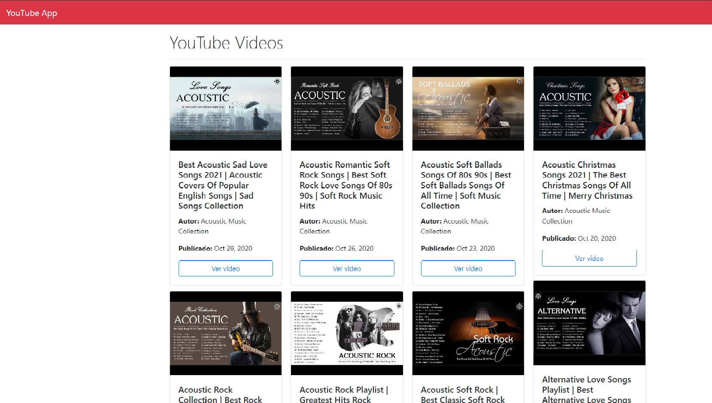

# YoutubeApp

Proyecto generado con [Angular CLI](https://github.com/angular/angular-cli) version 10.0.8.

## Objetivo
+ Conexion Api Youtube.
+ Cargar videos de 12 en 12 sin recargar pagina y aumentando el scroll.
+ Creacion de Modal con reproductor de video.
+ Deployment en Heroku

### Visita el proyecto.

[Visita el proyecto](https://appyou.netlify.app/)

+ Carpeta environment eliminada por motivos de seguridad
